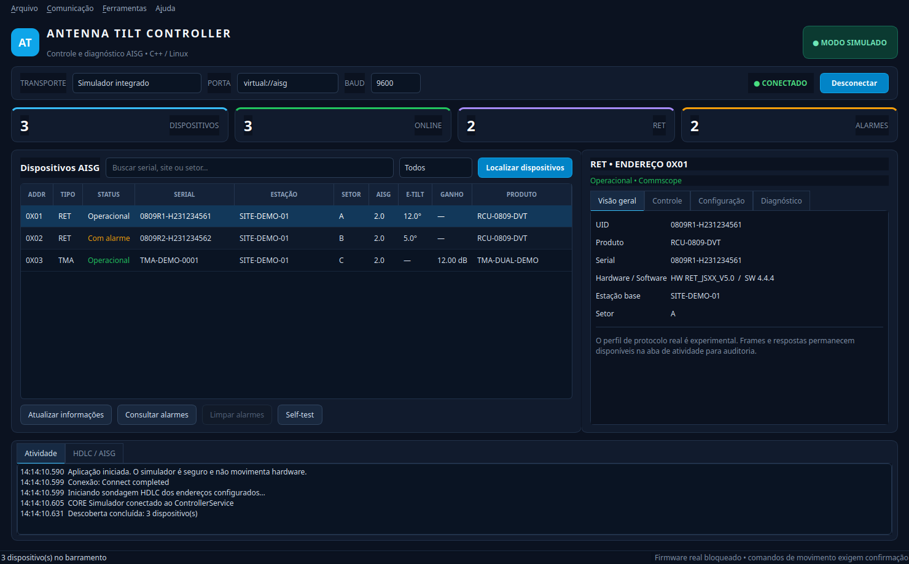
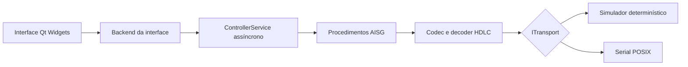

# Antenna Tilt Controller

[](https://github.com/Gecesars/aisg_controller_c-/actions/workflows/ci.yml)


[](LICENSE)

Controlador desktop para Linux, escrito em C++20 e Qt 6, para descoberta,
diagnóstico e operação de dispositivos AISG, RET e TMA. O projeto reúne uma
interface moderna, um núcleo de protocolo testável, transporte serial POSIX e
um simulador integrado que permite conhecer todo o fluxo sem conectar hardware.



> [!IMPORTANT]
> A versão atual é uma beta técnica. O simulador funciona de ponta a ponta; o
> perfil serial real é experimental e ainda não foi validado com uma estação
> AISG física. Antes de qualquer operação em campo, confirme pinagem, alimentação,
> terminação, endereço, perfil do fabricante e limites mecânicos da antena.

## Visão geral

Esta é uma implementação clean-room. O aplicativo Windows legado foi usado
somente como referência visual e para inventariar fluxos de trabalho. Código
decompilado, binários, firmware e módulos Python não são distribuídos nem
executados por este projeto.

O mesmo núcleo C++ processa as operações do simulador e do transporte serial:

- conexão, desconexão, descoberta assíncrona e cancelamento;
- inventário de dispositivos com filtros para RET, TMA e alarmes;
- leitura de produto, serial, versões de hardware/software e dados do site;
- consulta e limpeza de alarmes, self-test e calibração;
- movimento individual de RET e movimento sequencial por setor;
- configuração de ganho e modo normal/bypass de TMA;
- edição validada dos dados de instalação;
- relatório CSV, log de atividade e auditoria dos quadros HDLC TX/RX;
- simulador determinístico com dois RETs e um TMA;
- serial Linux baseada em `termios`, `poll` e timeouts explícitos.

### Estado das funções

| Função | Simulador | Serial real |
|---|---|---|
| Conectar e desconectar | Funcional | Implementado, não validado em hardware |
| Descobrir endereços existentes | Funcional | Experimental, SNRM/UA nos endereços 1–32 |
| Informações, alarmes e self-test | Funcional | Perfil experimental |
| Tilt individual e por setor | Funcional | Perfil experimental, exige confirmação |
| Calibração RET | Funcional | Perfil experimental |
| Ganho e bypass TMA | Funcional | Perfil experimental |
| CRC, framing e streaming HDLC | Testado | Mesmo núcleo testado |
| Descoberta/atribuição automática XID | Não implementada | Não implementada |
| Firmware, download e factory reset | Bloqueado | Bloqueado intencionalmente |

## Arquitetura



`ControllerService` mantém uma fila single-flight, publica eventos e snapshots
imutáveis e permite cancelar a operação ativa. A GUI não manipula bytes do
protocolo diretamente; ela conversa somente com o backend e com o modelo de
domínio.

## Requisitos

- Linux;
- compilador com suporte a C++20, como GCC 11+ ou Clang 14+;
- CMake 3.20 ou mais recente;
- Ninja ou outro gerador suportado pelo CMake;
- Qt 6.4+ com os módulos Core, Gui e Widgets;
- pthreads, fornecido pelo sistema.

Em Ubuntu 24.04, Debian 12 e derivados:

```sh
sudo apt update
sudo apt install build-essential cmake ninja-build qt6-base-dev
```

## Início rápido

```sh
git clone https://github.com/Gecesars/aisg_controller_c-.git
cd aisg_controller_c-

cmake -S . -B build-release -G Ninja \
  -DCMAKE_BUILD_TYPE=Release \
  -DATC_BUILD_GUI=ON \
  -DATC_BUILD_TESTS=ON
cmake --build build-release --parallel
ctest --test-dir build-release --output-on-failure
./build-release/antenna-tilt-controller
```

O atalho abaixo configura, compila e testa com as mesmas opções:

```sh
bash scripts/build-linux.sh
```

Se os headers do Qt estiverem em uma raiz Debian extraída localmente, informe-a
explicitamente durante a configuração:

```sh
cmake -S . -B build-release -G Ninja \
  -DATC_QT_DEV_ROOT=/caminho/para/root \
  -DCMAKE_BUILD_TYPE=Release
```

Para compilar apenas o núcleo e os testes, sem Qt:

```sh
cmake -S . -B build-core -G Ninja \
  -DCMAKE_BUILD_TYPE=Release \
  -DATC_BUILD_GUI=OFF \
  -DATC_BUILD_TESTS=ON
cmake --build build-core
ctest --test-dir build-core --output-on-failure
```

## Usar o simulador

O simulador é o modo inicial e não acessa portas nem movimenta hardware:

1. Abra `antenna-tilt-controller`.
2. Mantenha **Simulador integrado** selecionado e clique em **Conectar**.
3. Clique em **Localizar dispositivos**.
4. Selecione um RET ou TMA na tabela.
5. Explore as abas **Visão geral**, **Controle**, **Configuração** e
   **Diagnóstico**.
6. Consulte a aba **HDLC / AISG** para acompanhar os quadros transmitidos e
   recebidos pelo mesmo pipeline usado no modo serial.

O cenário contém RETs nos endereços `0x01` e `0x02` e um TMA no endereço
`0x03`. Um dos RETs começa com um alarme simulado para exercitar o diagnóstico.

## Usar uma conexão serial real

> [!WARNING]
> O aplicativo não alimenta o barramento AISG e não substitui um modem ou
> controlador elétrico adequado. O operador é responsável pela interface
> RS-485, proteção, alimentação e segurança mecânica da instalação.

A interface atual pressupõe um adaptador USB/RS-485 que controla a direção de
transmissão automaticamente. O backend ainda não habilita `TIOCSRS485`; UARTs
nativas que dependem do kernel para alternar RTS precisam de implementação e
validação adicionais.

Para liberar uma porta serial típica ao usuário atual:

```sh
sudo usermod -aG dialout "$USER"
```

Encerre a sessão e entre novamente para que o novo grupo seja aplicado. Depois:

1. conecte o hardware seguindo a documentação do fabricante;
2. selecione **Serial / RS-485**;
3. informe uma porta como `/dev/ttyUSB0`;
4. escolha o baud rate exigido pelo dispositivo — `9600` é o padrão inicial;
5. conecte e faça a descoberta;
6. confira endereço, serial, setor e limites antes de enviar qualquer comando.

A descoberta real atual apenas sonda endereços já atribuídos, de 1 a 32. Ela
não executa a árvore XID nem atribui endereços automaticamente.

## Opções de linha de comando

| Opção | Finalidade |
|---|---|
| `--help` | Exibe a ajuda |
| `--version` | Exibe a versão da aplicação |
| `--smoke-test` | Abre a interface e encerra após um teste curto |
| `--demo-test` | Conecta, descobre o cenário simulado e encerra |
| `--screenshot ARQUIVO` | Executa o cenário e salva uma captura PNG |

Em ambientes sem display, use o plugin offscreen:

```sh
QT_QPA_PLATFORM=offscreen \
  ./build-release/antenna-tilt-controller --smoke-test

QT_QPA_PLATFORM=offscreen \
  ./build-release/antenna-tilt-controller --demo-test

QT_QPA_PLATFORM=offscreen \
  ./build-release/antenna-tilt-controller \
  --screenshot build-release/atc-demo.png
```

## Instalar e empacotar

Instalação em `/usr/local`:

```sh
sudo cmake --install build-release --prefix /usr/local
```

Isso instala o executável, a entrada de menu, o ícone e a documentação. Os
caminhos instalados ficam registrados em
`build-release/install_manifest.txt`; revise esse arquivo antes de uma remoção
manual.

Para gerar um pacote TGZ dependente das bibliotecas Qt 6 do sistema:

```sh
bash scripts/package-linux.sh
```

O pacote é criado em `dist/` com a versão e a arquitetura detectada pelo CMake.

## Testes

A suíte cobre sete cenários de protocolo, domínio, transporte e controlador:

- CRC-16/X-25 e quadros capturados;
- stuffing, unstuffing e decoder incremental;
- validações do domínio;
- simulador em baixo nível;
- falha segura do transporte serial POSIX;
- fluxo ponta a ponta do controlador;
- cancelamento de operação.

Execução direta:

```sh
ctest --test-dir build-release --output-on-failure
./build-release/atc_core_tests
```

Build opcional com AddressSanitizer e UndefinedBehaviorSanitizer:

```sh
cmake -S . -B build-sanitize -G Ninja \
  -DCMAKE_BUILD_TYPE=Debug \
  -DATC_BUILD_GUI=OFF \
  -DATC_BUILD_TESTS=ON \
  -DCMAKE_CXX_FLAGS="-fsanitize=address,undefined -fno-omit-frame-pointer" \
  -DCMAKE_EXE_LINKER_FLAGS="-fsanitize=address,undefined"
cmake --build build-sanitize
ctest --test-dir build-sanitize --output-on-failure
```

O workflow em `.github/workflows/ci.yml` repete o build, o CTest e os testes
offscreen da GUI em Ubuntu.

## Estrutura do projeto

```text
.
├── include/atc/                 API pública do núcleo
├── src/
│   ├── aisg.cpp                 codecs de procedimentos AISG experimentais
│   ├── controller.cpp           fila, eventos e operações assíncronas
│   ├── domain.cpp               modelo e validações
│   ├── hdlc.cpp                 CRC, framing e decoder incremental
│   ├── posix_serial_transport.cpp
│   ├── simulated_transport.cpp
│   └── gui/                     aplicação Qt Widgets
├── tests/test_main.cpp          testes sem framework externo
├── resources/                   ícone e entrada desktop
├── docs/images/                 imagens curadas para a documentação
├── scripts/                     build e empacotamento Linux
└── licenses/                    avisos das referências permitidas
```

## Protocolo e interoperabilidade

O núcleo implementa CRC-16/X-25, delimitadores e byte stuffing HDLC, decoder de
stream, troca SNRM/UA e um conjunto experimental de I-frames para as operações
expostas na interface. Os opcodes e perfis precisam ser conferidos contra a
especificação e a documentação do fabricante antes do uso em campo.

Referências normativas úteis:

- [3GPP TS 25.462 — Iuant signalling transport](https://portal.3gpp.org/desktopmodules/Specifications/SpecificationDetails.aspx?specificationId=1217)
- [ETSI TS 125 462](https://www.etsi.org/deliver/etsi_ts/125400_125499/125462/06.05.01_60/ts_125462v060501p.pdf)
- [ETSI TS 125 466](https://www.etsi.org/deliver/etsi_ts/125400_125499/125466/17.00.00_60/ts_125466v170000p.pdf)

Este projeto não declara certificação AISG nem compatibilidade universal com
perfis proprietários.

## Segurança operacional

- O modo simulado deve ser usado durante desenvolvimento e treinamento.
- Toda movimentação real exige confirmação explícita na interface.
- O destino deve ser conferido por endereço, UID/serial e setor.
- O tilt solicitado é validado contra os limites conhecidos do RET.
- Movimento de setor é sequencial, não atômico, e pode terminar parcialmente.
- Firmware, download de dispositivo e factory reset permanecem desabilitados.
- Logs HDLC podem conter identificadores do site; remova-os antes de compartilhar.

O repositório `ret_aisg2` foi tratado exclusivamente como referência estática e
não é uma dependência. Consulte [SECURITY.md](SECURITY.md) antes de manipular
esse material. Dependências e atribuições estão em
[THIRD_PARTY.md](THIRD_PARTY.md).

## Solução de problemas

### CMake não encontra Qt 6

Instale `qt6-base-dev`, informe `CMAKE_PREFIX_PATH` para uma instalação Qt ou
use `-DATC_QT_DEV_ROOT=/caminho/para/root` no layout Debian suportado pelo
fallback.

### `Permission denied` ao abrir `/dev/ttyUSB0`

Confirme a propriedade com `ls -l /dev/ttyUSB0`, adicione o usuário ao grupo
apropriado (`dialout` na maioria das distribuições) e reconecte o adaptador.

### Nenhum dispositivo é encontrado

Teste primeiro o simulador. No hardware, confira alimentação externa, A/B,
terra de referência, terminação, baud rate, controle automático de direção e
se os dispositivos já possuem endereços entre 1 e 32.

### Timeout ou respostas HDLC incompletas

Verifique o log **HDLC / AISG**. Um adaptador sem controle automático de direção,
eco local, inversão de A/B ou perfil de fabricante diferente pode impedir uma
resposta válida.

### A GUI não abre em um servidor

Use `QT_QPA_PLATFORM=offscreen` apenas para smoke tests. Para uso interativo é
necessário um ambiente gráfico Qt compatível.

## Limitações e roadmap

- validar serial e operações com hardware AISG real;
- implementar descoberta, atribuição e negociação XID completas;
- oferecer `TIOCSRS485` configurável para UARTs nativas;
- separar perfis/opcodes por fabricante e versão do protocolo;
- ampliar testes com capturas independentes e hardware-in-the-loop;
- adicionar pacotes nativos e releases reproduzíveis;
- manter firmware e factory reset fora do escopo até existir uma cadeia de
  segurança específica e extensivamente testada.

## Contribuir

1. Crie uma branch curta a partir de `main`.
2. Mantenha o núcleo independente de Qt sempre que possível.
3. Adicione testes determinísticos para mudanças de protocolo ou domínio.
4. Execute CTest e o smoke test offscreen.
5. Abra um pull request explicando o dispositivo/perfil afetado e os riscos.

Não inclua firmware, especificações não redistribuíveis, dumps com dados de
clientes ou código decompilado. Relatórios de segurança não devem expor
credenciais ou dados de sites em issues públicas.

## Licença

O novo código é distribuído sob a licença [MIT](LICENSE). Materiais de referência
mantêm suas próprias licenças e condições; veja [THIRD_PARTY.md](THIRD_PARTY.md)
e os avisos em `licenses/`.
